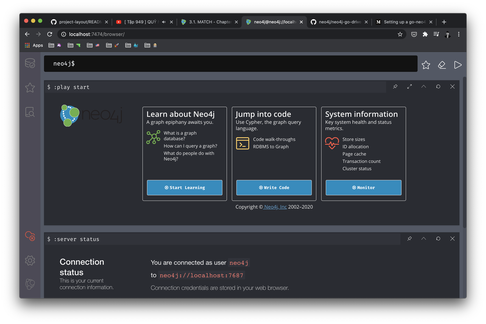
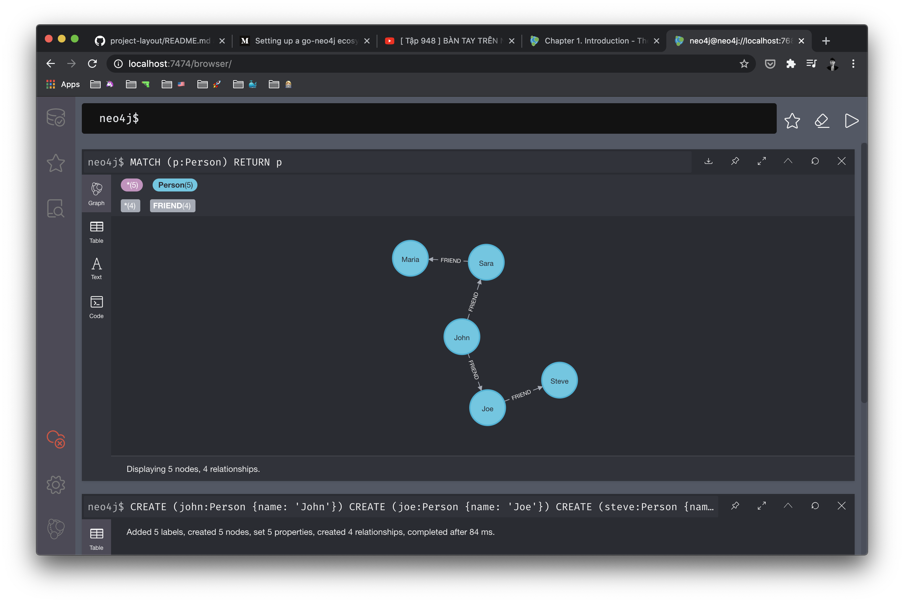

# neo4j

Learning 📺 Neo4j

## Docker

```shell
docker run -p 7474:7474 -p 7687:7687 \
    --env NEO4J_AUTH=neo4j/123456 \
    --volume=$HOME/neo4j/data:/data \
    neo4j
```

**Connect to Neo4j**


**Result**



## Go client

```shell
go run go_client/main.go
```

## Go client CRUD

```shell
go run go_client_crud/main.go
```

## Cheat sheet 💅

### Create model & relationship

```
CREATE (john:Person {name: 'John'})
CREATE (joe:Person {name: 'Joe'})
CREATE (steve:Person {name: 'Steve'})
CREATE (sara:Person {name: 'Sara'})
CREATE (maria:Person {name: 'Maria'})
CREATE (john)-[:FRIEND]->(joe)-[:FRIEND]->(steve)
CREATE (john)-[:FRIEND]->(sara)-[:FRIEND]->(maria)
```

### Find all Person

```
MATCH (p:Person) RETURN p
```



### 

## Documents

- [Neo4j clauses](https://neo4j.com/docs/cypher-manual/current/clauses/)
- [The Neo4j Cypher Manual](https://neo4j.com/docs/cypher-manual/current/)
- [Neo4j Cheat Sheet](https://simplecheatsheet.com/tag/neo4j-cheat-sheet/)

## License

MIT © [Cuong Tran](https://github.com/103cuong)
